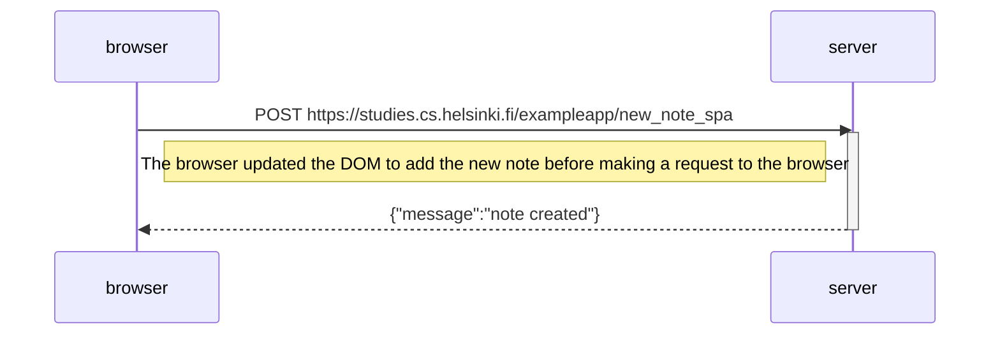

```mermaid
sequenceDiagram
  participant browser
  participant server

  browser->>server: POST https://studies.cs.helsinki.fi/exampleapp/new_note_spa
  activate server
  Note right of browser: The browser updated the DOM to add the new note before making a request to the browser
  server-->>browser: {"message":"note created"}
  deactivate server
```